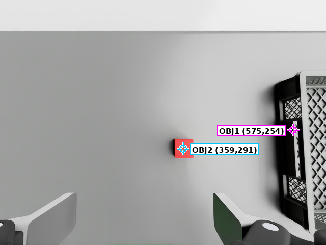

# arm-with-stereoCamera

A 6-axis robot arm (NHC12) with a Robotiq 2F-85 gripper and an Intel
RealSense D455 stereo camera on the wrist, running in NVIDIA Isaac Sim.

Drag a target in the viewport and the arm follows it in real time using
inverse kinematics (IK). The camera can also take a snapshot and return
the position and size of objects on the table.

---

## Required folders

You only need these three folders to run the demo. Everything else can
be left out.

| Folder | Purpose |
|---|---|
| `scenes/` | The Isaac Sim scene file. Open it with File > Open. |
| `scripts/` | The Python scripts the demo runs: start, IK control, camera capture. |
| `assets/` | 3D model files the scene needs (arm, gripper, table, camera). The scene points to these files by relative path, so keep the folder layout as it is. |

Keep all three folders together, under the same root folder. Do not move
or rename them separately.

---

## Requirements

- NVIDIA Isaac Sim 6.0 (or a compatible version)
- A machine with a GPU that can run Isaac Sim

---

## How to use

### 1. Open the scene

`File > Open` → select `scenes/arm310d_d455_ik_demo_r8.usd`

### 2. Start the demo

`Window > Script Editor` → open `scripts/demo_start.py` → press `Ctrl+Enter`

This one step will: press Play, load the IK controller, and start IK
following. When you see `"status": "ready"` in the result, it worked.

> Why not open `ik_controller.py` directly? Isaac Sim's Script Editor does
> not share variables between "run a file" and "the interactive console".
> If you open `ik_controller.py` on its own, calling `ik_follow_status()`
> from the console later will fail with `NameError`. `demo_start.py`
> avoids this problem, so always start from `demo_start.py`.

### 3. Drag the target

In the viewport, drag `/World/IKTarget` (the small green cube) with the
mouse. The arm follows it automatically.

Before capturing a snapshot, call `ik_follow_status()` to check the
tracking error is small enough (`last_error.pos_error_norm_m` should be
much less than `0.005`).

### 4. Capture a snapshot (optional)

```python
demo_capture()          # returns {"status": "scheduled"} right away
demo_capture_status()   # call this a few seconds later to get the result
```

On success, files are saved to `outputs/captures/<run_id>/`: color and
depth images, plus `result.json`. This folder is created automatically
when you run a capture — you don't need to make it yourself.

**Known limitation**: the depth values are not camera-calibrated, so do
not treat them as exact measurements. Object detection only finds
"raised areas on the table" — it does not know what the object is. There
is also a known, occasional bug where the IK target itself gets captured
in the frame.

### 5. Stop

```python
ik_follow_stop()   # moves the arm back to a saved clean pose [0,0,0,0,0,0]
```

Then press the ■ Stop button on the timeline.

---

## Available functions

| Function | File | Description |
|---|---|---|
| `demo_start()` | `demo_start.py` | One-step start: Play + load scripts + start IK |
| `demo_stop()` | `demo_start.py` | Stop IK and move back to a clean pose |
| `ik_follow_start()` | `ik_controller.py` | Start drag-and-follow |
| `ik_follow_status()` | `ik_controller.py` | Check current tracking error and status |
| `ik_follow_stop()` | `ik_controller.py` | Stop and move back to a clean pose |
| `demo_capture()` | `capture_d455.py` | Schedule one snapshot |
| `demo_capture_status()` | `capture_d455.py` | Get the result of the last snapshot |

---

## Example output

This is a real result from `demo_capture()`. The picture below is
`rgb_color_annotated.png` from the output folder — it marks each detected
object with a box and an id:



`result.json` lists every detected object under `tabletop_objects.objects`.
Each entry gives a pixel box, a world-space position, and a size — no
object naming, just "what's on the table". Here is `object id 2` (the red
cube in the picture above) as an example:

```json
{
  "id": 2,
  "bbox_px": [380, 272, 420, 308],
  "surface_center_world_xyz_m": [-0.254315, 0.001208, 0.64529],
  "surface_extent_world_m": {
    "x": 0.050046,
    "y": 0.050004,
    "z": 0.038086
  },
  "camera_to_surface_center_distance_m": 0.468331,
  "height_above_plane_m": 0.049996,
  "center_reliability": "ok"
}
```

Field meaning, in plain words:

| Field | Meaning |
|---|---|
| `bbox_px` | The object's box in the image, in pixels |
| `surface_center_world_xyz_m` | The object's top-surface center, in world coordinates (meters) |
| `surface_extent_world_m` | The object's size in x/y/z (meters) |
| `camera_to_surface_center_distance_m` | Distance from the camera to the object (meters) |
| `height_above_plane_m` | How high the object sticks up above the table (meters) |
| `center_reliability` | `"ok"` means the object was fully inside the image; `"truncated_by_image_border"` means part of it was cut off at the edge |

As the known-limitation note above says, these numbers come from an
uncalibrated depth camera — good for a rough estimate, not for precise
measurement.

---

## What this repo does not include

This is a trimmed release from an internal development project. It keeps
only what you need to run the demo. Development task logs, reviews,
agent-workflow files, old debugging scripts, and one-off scene-build
scripts are not included here.
